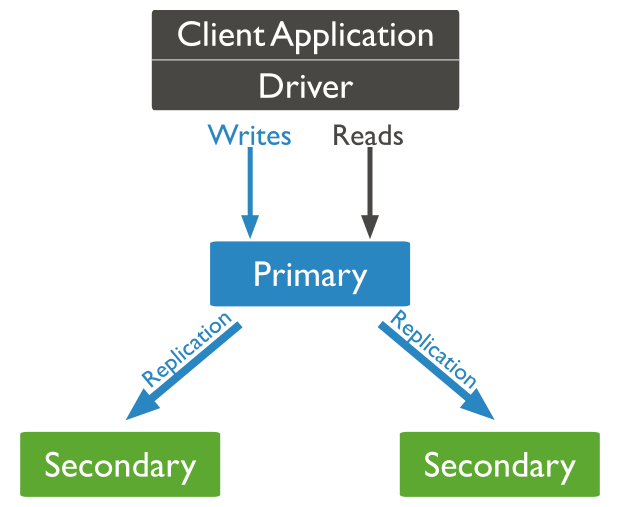

# Introduction

Over the course we will interact with a [standalone](https://docs.mongodb.com/manual/reference/glossary/#std-term-standalone) MongoDB, once it meet our needs.
But, It is important to have in mind what are the existing components for MongoDB, once in productive enviroments it is likely you will interact with all of them.   

# Components
The existing components for MongoDB are:
- [mongo](https://docs.mongodb.com/upcoming/reference/program/mongo/#mongodb-binary-bin.mongo) *It is the **mongo shell** itself, an interactive JavaScript shell interface to MongoDB where we use to connect and run commands*.
- [mongod](https://docs.mongodb.com/manual/reference/program/mongod/#mongodb-binary-bin.mongod) *It is the primary **daemon process**, the core process for the MongoDB system*.
- [mongos](https://docs.mongodb.com/manual/reference/program/mongos/) *It is the process that route queries and write operations in a [sharded cluster](https://docs.mongodb.com/manual/sharding/)*. 

There is also [The MongoDB Database Tools](https://docs.mongodb.com/database-tools/). Which is a set of tool for administrative tasks as Dump/Restore, and Import/Export.

# Components interaction

To access the instance(*[mongod](https://docs.mongodb.com/manual/reference/program/mongod/#mongodb-binary-bin.mongod)*) we need a tool able to do so. To this end, we can use the mongo shell(*[mongo](https://docs.mongodb.com/upcoming/reference/program/mongo/#mongodb-binary-bin.mongo)*) or any third-party tool.

mongo *→ connects to →* mongod

Over the course, all contents and structure 
This is some text.

Here's a single line of runnable code:

`printf 'Hello, world!\n\n'`{{execute}}

